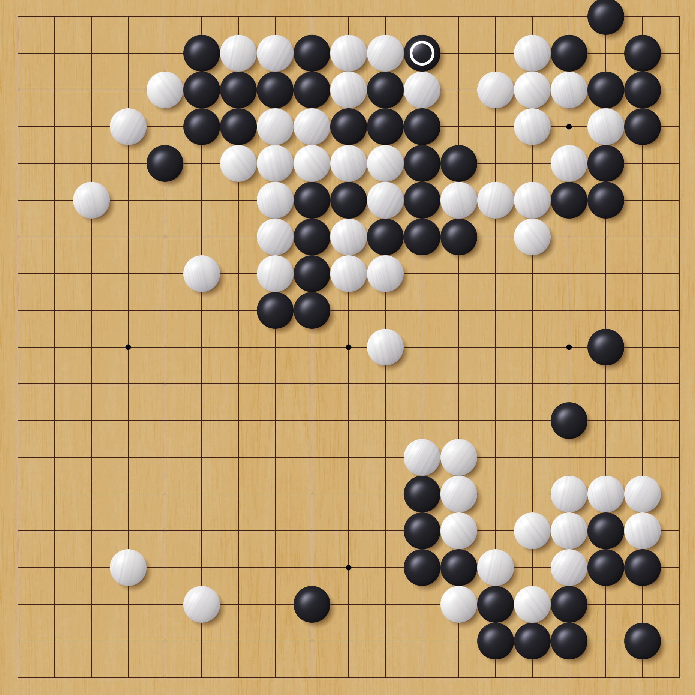

我学数学的时候，偶尔读一些关于围棋的文章。围棋和国际象棋一样，也是一种是完全信息博弈，没有任何运气成分。所以，数学家门自然对这类游戏很感兴趣。

> (To avoid repeating 完全信息游戏, can use 这类 (zhè lèi) to mean "this type of (game)")

那时，我和同学们都不会下围棋，所以我没有真正下围棋。我看了围棋的规则书里有很多日语词, 比如“Atari", "Komi", "Moyo", "Miai"。其实，那半熟不只有围棋规则，还包含围棋策略。那是一本书让数学家们感兴趣的书，所以内容不太容易。虽然围棋的规则很简单，但他的策略太深了。

> Original "我和同学不会下棋，所以我没下棋", but feedback was 没有下棋 was "very basic", and that 真正这下过期 was more natural. I would omit this in English (I would say "I hadn't played" rather than "I actually did not have the experience of playing")'。
> Also 策略 (cèlüè) is the term for strategy.
> We also had a good use for 包含。My original was 那本书不是只有A，内容还有B (the book  didn't only talk about A, the content also included B) to a more natural 不只有A，还包含B

如果当时我只看了规则，并且找到一个同学一起玩儿的话，我就可以开始下围棋了。

2014年，我是一名大学教授。当时，我和一个经济学教授同事一起常常玩棋盘游戏。他的研究专门是游戏，他给我介绍了很多种游戏。一天，他问我有没有玩过围棋。我回答说没玩过，但是我在学生时代我就想学下围棋。那天，他教我围棋的规则，然后我和他下了我人生中的第一盘围棋。我输了哈哈哈。

> Important note： He asked me if I had ever.... is 他问我有没有 Verb 过， NOT 他问我我如果 Verb 过。。。。。. 如果 is only for conditional statements, not about whether or not statements.
> 在学生的时候 is better as either 上学的时候 (while I was attending school) or 学生时代 （during my student days）

他玩的(~~行为~~)方式不太（~~善良~~）友善。他喜欢先给别人介绍新游戏，然后用自己的经验轻松赢他们。

## 学围棋的建议

* 先学围棋的规则。玩过几盘之后，再可以学策略。
* 找一个会下围棋的人教你规则，这比只读规则书更容易，也更有趣.
* 先在小棋盘上玩几盘，比如 9x9。虽然标准大小是19x19.

> Original attempt: 比读数学规则更容易和喜欢的.

## 优缺点

和其他棋类游戏相比，我喜欢围棋的地方：

1. 规则简单，但策略极深。
2. 它是完全信息游戏，没有运气成分。
3. 每个期子都一样的。
4. 玩久了，你会自己发现一些规则里没写的概念。

国际象棋有6种棋子，每种都有特别的移动规则。其中，王这个棋子，特别重要。国际象棋的重点是保护你的王，同时捉住对方的王。相比之下，围棋子都一样的。

围棋不是完美的游戏。我觉得围棋的缺点是。这一点比较复杂，所以我先用英语写下来，然后再翻译成中文。

* There is a lack of immediate feedback. It may take many turns for an error to become obvious
  * 围棋不能立刻给你反馈。你可能要下很多步之后，才能发现一个错误，而且就算发现了，也常常不清楚到底是在哪一步走错了。
* It is not obvious what the score is during the game, particularly if you lack experience.
  * 对于新手来说，下围棋时常常很难判断谁占优势，尤其经验不足的话就更看不清了。
  * Initially opened with "你就开始下围棋" to mean "when you first start playing go", but in Chinese this suggests the beginning of a particular match, not that you are a beginner who is just getting used to go.
* There are not clear goals in the beginning of the game. To understand why early moves are good, you need to understand the strategy very deeply, something you only get by playing a lot of games. So your first few games the initial moves seem pointless.
  * 在围棋开局时，不清楚最好的下法在哪里。要想理解为什么早期的一些步法是好的，你需要有很深的策略理解。这种理解只能通过下很多盘棋才能获得。所以，在你最初下的几盘棋里，开始的那些走法可能会让你觉得没什么意义。
* A single mistake can make your game go from certain victory to crushing defeat.
  * Mine: 一个错误让你的成功围棋盘成为没希望了输。
  * Deepseek: 一个错误就足以让稳赢的棋变成一场惨败。

#### 生词

| 生词     |              | 英语        |
|---------|--------------|-------------|
| 博弈     | bóyì         | Playing games (with stones) |
| 棋类游戏 | qí lèi yóuxì | Board Games |
| 策略    | cèlüè        | Strategy    | 
| 友善    | yǒushàn      | Friendly    |
| 这类    | zhè lèi      | This type/this style |
| 成分    | chéngfèn     | element of (e.g. 运气成分) |
| 概念    | gàiniàn      | concept     |
| 象棋    | xiàngqí      | Chess (中国或者国际) |
| 捉住    | zhuōzhù      | capture     |
| 相比之下。。。 | xiāng bǐ zhī xià | In contrast ...|
| 反馈    | fǎnkuì       | feedback    |
| 步      | bù           | turns （measure）|
| 局      | jú           | games (measure)
| 对于新手来说 |           | From a beginner's perspective| 
| 谁占优势 | shuí zhàn yōushì| who is winning |
| 得分    | défēn         | score       |
| 开局 |kāijú | Opening stage in a game |
| 目标 |mùbiāo | Goal / objective |
| 走法 | zūofǎ | moves |
| 稳赢 | wěn yíng | certain to win |
| 惨败 | cǎnbài | crushing defeat |