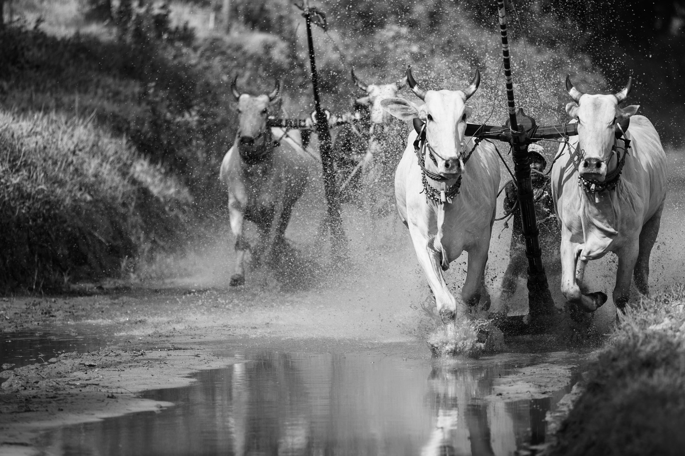
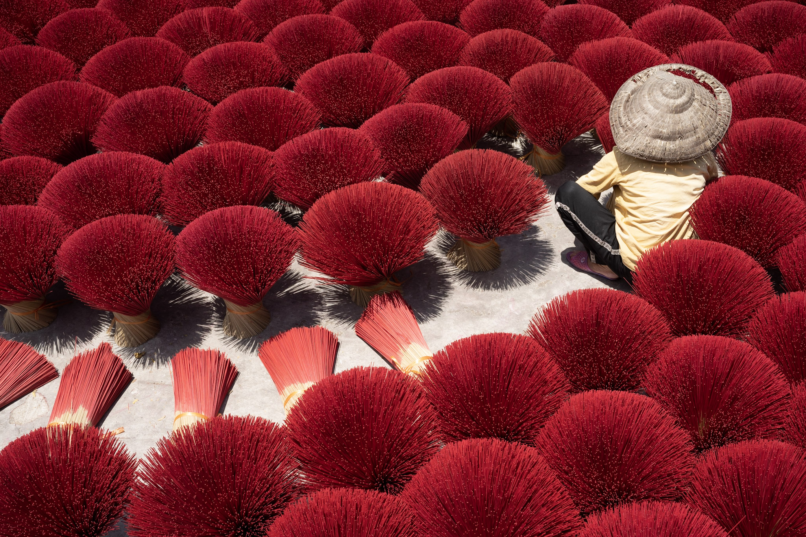
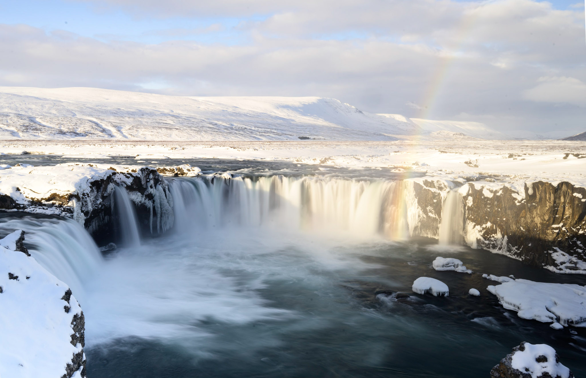
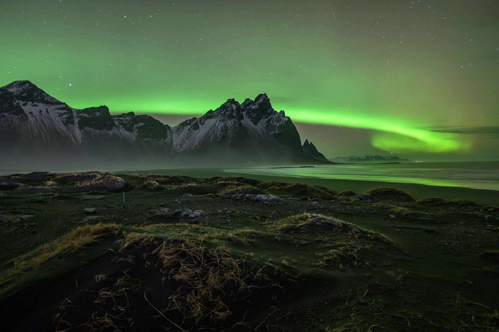
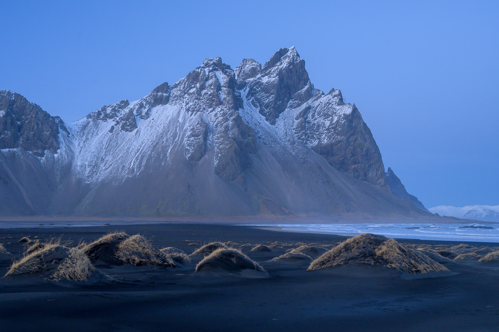
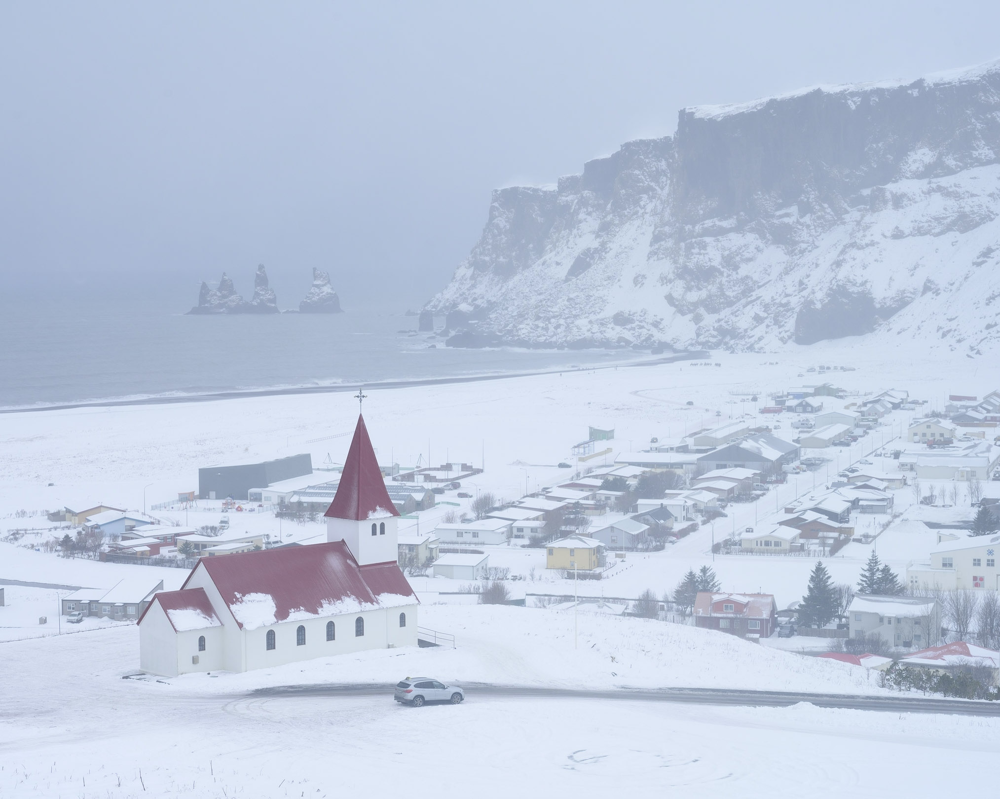
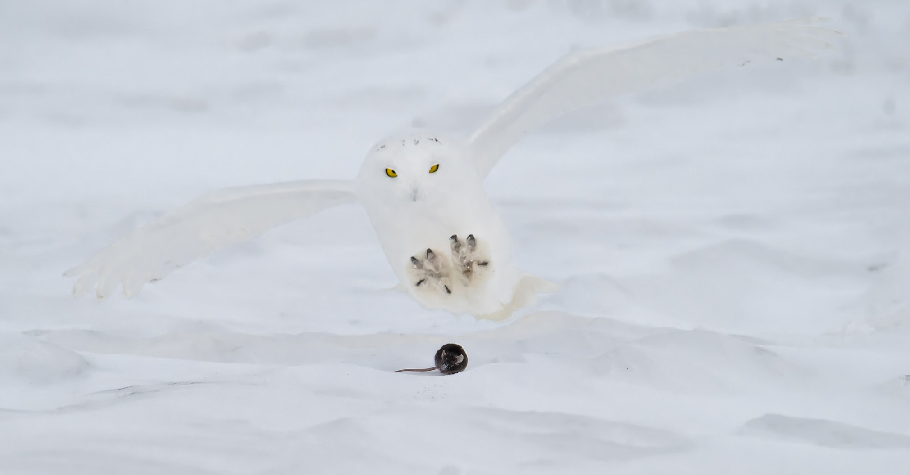
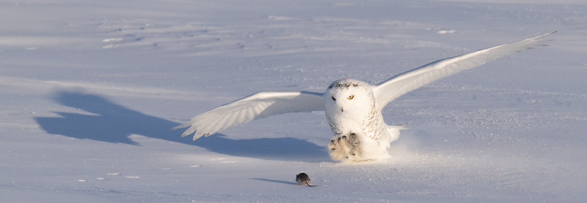

最近四年，我去过几次旅游。一些旅行是自由行，一些旅行是跟团游。我比较喜欢自由游。

## 跟团游

我的跟团游都是摄影旅行。预定以前，我希望跟团游研究很美丽的地方，有意思的活动，等。我的放假很短，所以专业帮我发现最美丽的地方很有用。第一次跟团游去越南。虽然旅行只有14天，我们去10个城市！就算我我为了这次做了三年攻略，我也不可能发现所有这些特别的活动。

::: {#fig-viet layout-ncol=3}

越南的特别活动
:::

另外，我不会说越南话，对越南的景点也不熟。

第二次跟团游是冰岛。我要看瀑布，北极光和冰洞。大部分冰岛人说英语，所以我可能自由行。我希望跟团游给我特别的地方和活动。这次旅游，导游跟无聊。他不要早出去，也不要晚会酒店。

::: {#fig-iceland1 layout-ncol=3}

导游还陪我们很美丽的地方！
:::

除了冰冻，我觉得做攻略发现了一样的地方.

::: {#fig-ice layout-ncol=2}

{width=65%}

:::

第三次是意大利，第四次是中国。

Need something to go here.

最不好的跟团游是去加拿大那次。跟团游的目标是拍到雪猫头鹰。导游的安排不好，吃的饭很无聊，没有跟当地人见面。每次吃饭导游都告诉我们：Trump是最好的总统，现代社会对白男不公平，很多DEI，等等

::: {#fig-owls layout-ncol=2}

虽然导游很麻烦，猫头鹰很厉害。
::: 

## 自由行