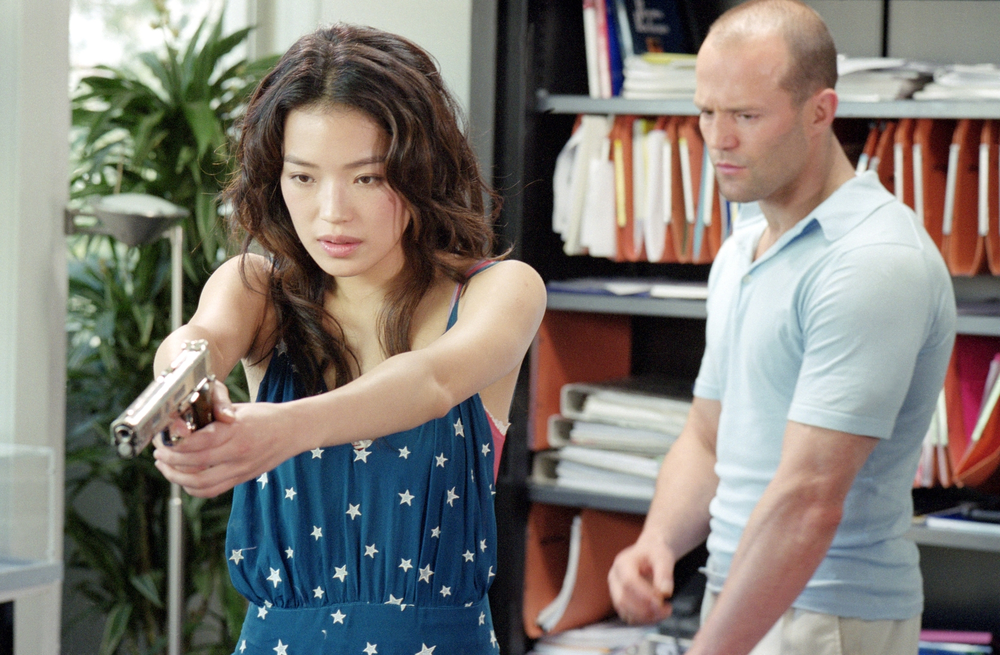
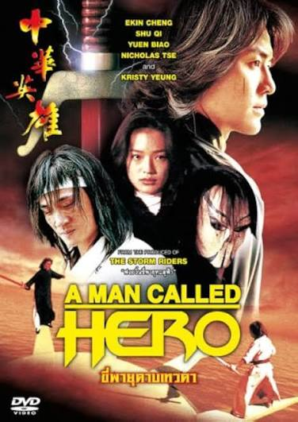
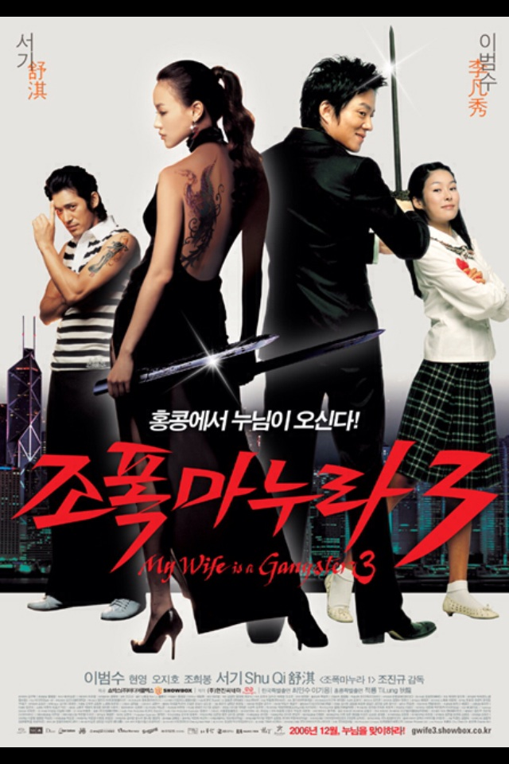
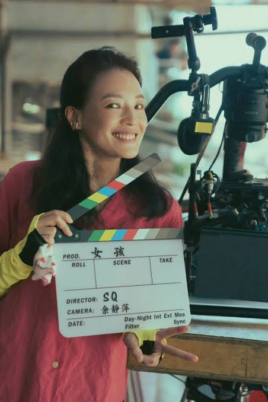
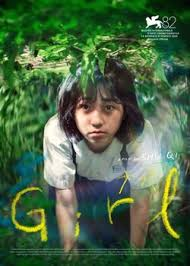

林立慧是台湾很有名的演员。她出生于1976年4月16日。她的艺名是舒淇。

舒淇小时候生活不容易。爸爸常常喝酒，他的脾气不好。爸爸生气的时候，舒淇在衣柜里，所以她碰不到她爸爸。妈妈很年轻的时候就生了舒淇，觉得失去了很多机会，所以后悔生了舒淇。舒淇的妈妈常常骂她特别丑。

15岁的时候，舒淇离开了家，因为跟父母一起住压力太大了。一天，舒淇发生了一场严重的车祸。她身上留下了疤痕。妈妈看见疤痕，却没有同情心。她看起来不在乎。妈妈只有骂了舒淇。

舒淇很羡慕香港的演员。她特别羡慕Karen Mok。舒淇决定搬去香港找演员的工作。舒淇跟自己说：如果五年以后我没有成为成功的演员，就回台湾嫁给一个合适的男人。

进入演艺圈很难。她一开始做写真工作，然后在三级片里当演员。虽然那部电影是性剥削的，但是一个电影很严肃：《色情男女/Viva Erotica》。这部电影的话题是软色情的行业。虽然这部电影有一些裸体镜头，但是不是性剥削的电影。这是舒淇的突破角色。凭借那个电影，舒淇赢得了表演的奖项。《色情男女》以后，舒淇没有性剥削的角色了，但是她还有一些情色的角色。

著名导演李安曾想给舒淇《卧虎藏龙》里玉娇龙的角色。舒淇已经有Coke广告的合同，不可能安排两个同时工作。虽然她想跟李安工作，但是她得养家。因为Coke广告的报酬比电影的更高，所以舒淇选择了广告。这个结果让舒淇后悔莫及。这个情况以后，舒淇和经纪人就分开了。

::: {#fig-movies layout-ncol=3}

:::

在00年代里，舒淇有各种各样的角色。《千禧曼波》（2001) 是严肃的电影，表现了舒淇的演技。除了严肃的中国电影，舒淇也有香港喜剧片和美国的动作片。她还有一个韩国的电影(My Wife is a Gangster 3)。虽然她的美国电影的角色是美丽女人的角色，但是中国电影的角色表现舒淇的演技。舒淇又美丽又成功。

虽然舒淇很成功，但是有很多问题。她常常觉得很抑郁。舒淇想养孩子，但是她担心自己会重蹈父母的覆辙。她尝试过生育。舒淇有一些健康问题，他的身体不能怀孕。

现在舒淇很高兴。虽然她还没有孩子，但是结婚了。他的老公是Steven Fung。Steven也是有名的电影演员。

::: {#fig-movies layout-ncol=2}

:::
2025年，舒淇执导了第一部电影。这部电影叫《Girl》。这部电影的灵感来自她的小时候。电影结束有和解。舒淇讲虽然真的生活很乱，没有安静的和解，但是电影故事给观众满意的结论。舒淇有很多影响，她在很重要的社会问题上影响着大家，特别是女人的社会问题。
